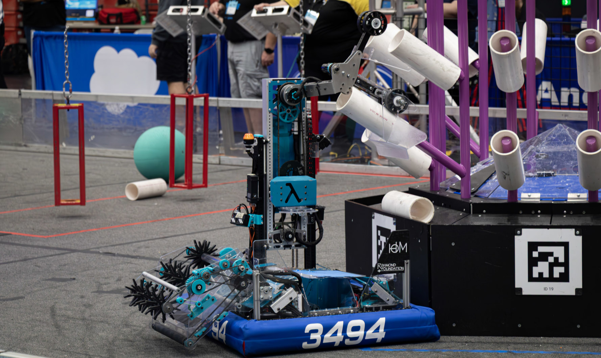

## FRC 3494 Quadrangles 2025 Repo - Lambda!

Featuring:
  - A single stage elevator
    - With magnetic encoder for active zeroing
  - Dual use arm intake and dual use ground intake
    - With an absolute encoder to monitor arm rotation
    - Ground intake capable of scoring L1 and passing into arm
  - Auto align and April Tag relocalization
    - [Specialized pose estimation](./src/main/java/frc/robot/subsystems/drive/Drive.java:304)
    - Swerve drive with full field odometry and a simplified Kalman filter
  - Finite state machine
    - Intake current monitoring
    - Algae Mode and Coral Mode with influence on auto align and arm power
  - Special odometry tuning functions
    - [Automatic wheel zeroing](./src/main/java/frc/robot/commands/WheelOffsetCalculator.java)
    - [Wheel radius tuning based on the IMU](./src/main/java/frc/robot/commands/WheelRadiusCharacterization.java)
  - Full robot logging
    - Logs the outputs of every subsystem for after match debugging

